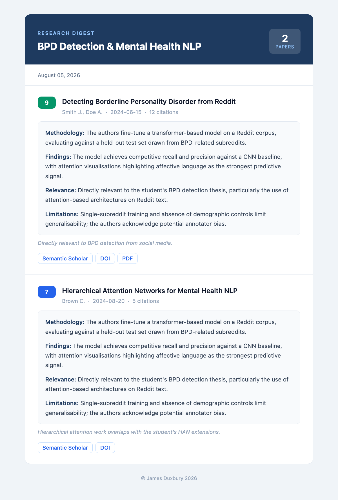
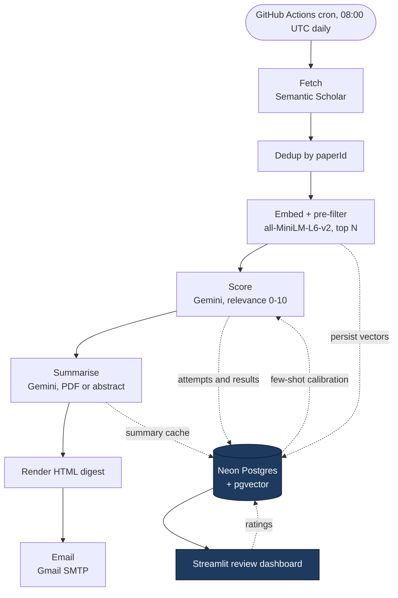

# Researcher Agent

[](https://github.com/jsduxie/researcher-agent/actions/workflows/research_agent.yaml)
[](https://codecov.io/gh/jsduxie/researcher-agent)
[](https://www.python.org/downloads/release/python-3110/)
[](LICENSE)

A cost-aware LLM pipeline that emails me a daily digest of new research papers relevant to my MEng thesis on mental-health classification and explainability. It runs unattended on a GitHub Actions cron, and a Streamlit dashboard lets me rate the results so the agent picks better papers over time.

## What this demonstrates

The interesting parts are not the fetch and the email, but how the pipeline stays within free-tier limits and improves from feedback:

- **A local embedding pre-filter** ranks every candidate against my research context with `all-MiniLM-L6-v2`, so only the top N spend Gemini quota.
- **A per-attempt Gemini call budget** trips during a 429 retry storm, so the remaining papers are still emailed without summaries instead of the run exhausting the daily quota or failing outright.
- **A feedback loop**: ratings I give on the dashboard are stored as vectors, retrieved by similarity at scoring time, and injected as few-shot examples into the scorer prompt. No retraining.
- **Operational hardening** for a free-tier stack: serverless Postgres that suspends idle connections, an embedding model shipped from a release asset rather than the HuggingFace hub, and CI coverage gates.

## Screenshots

Review dashboard (rate a run, browse history, edit configuration):


A sample digest email:



## Architecture



Each run is a single linear pass orchestrated by `main.py`:

1. **Fetch** (`fetcher.py`) queries Semantic Scholar for each configured search and collects the results. A run where every query errors exits non-zero so the cron failure is visible.
2. **Dedup** collapses papers seen across queries and drops any without a `paperId` (the primary key), since they cannot be persisted or deduplicated across runs.
3. **Pre-filter** (`embedder.py`) embeds the research context and every candidate locally, ranks by cosine similarity, and passes only the top N to the scorer. Vectors are persisted to `pgvector` for later similarity retrieval.
4. **Score** (`scorer.py`) sends batches to Gemini for a 0-10 relevance judgement. If enough ratings exist, a few-shot calibration block is built from similar rated papers and prepended to the prompt.
5. **Summarise** (`summariser.py`) summarises each kept paper, uploading the PDF through Gemini's Files API where available and falling back to the abstract otherwise. Where Semantic Scholar supplies no open-access PDF, the DOI is looked up on Unpaywall and the landing page's `citation_pdf_url` meta tag is scraped as a second attempt, so more papers are summarised from full text. Downloads are rejected unless they carry the `%PDF` header, which keeps an HTML landing page from reaching Gemini.
6. **Render and email** (`render.py`, `emailer.py`) build the HTML digest and send it over Gmail SMTP.

Postgres (Neon) and the Streamlit dashboard sit to the side of the pipeline as stores rather than stages: the run writes papers, runs, vectors, prompts and results; the dashboard reads them back and writes ratings, which feed the next run's calibration.

## Design decisions

The choices below are the non-obvious ones. Most of them exist because the project runs on free tiers, where the limited resource is API quota and connection lifetime rather than compute.

**A local model pre-filters before Gemini is called.** Gemini's daily quota is the bottleneck, so candidates are ranked locally with `all-MiniLM-L6-v2` first and only the top N are scored. The embedding step takes a few seconds and keeps the budget for the papers most likely to matter. The vectors are kept rather than discarded: they persist to `pgvector` and feed the feedback loop.

**The Gemini budget is enforced per attempt, not per paper.** A 429 retry storm can consume calls without producing a single result. The budget check runs on each attempt and raises before the count increments, so the cap trips on the next attempt rather than several attempts past it. When it does, the remaining papers are emailed without full summaries instead of failing the run. A `PerDay` quota violation is terminal (nothing will succeed until the window resets), whereas per-minute and burst 429s are retried with server-suggested backoff.

**No database session is held during Gemini calls.** Neon's serverless pooler suspends idle connections, and the LLM calls are the slow part of a run. Scoring and summarising therefore run with no connection open, and short scoped sessions bracket the work to persist results. A `@database_reconnect` decorator catches a single `OperationalError`, reopens a fresh session and retries once, which handles Neon reaping a connection between sessions. Connections use `autocommit` with `prepare_threshold=None` to stay compatible with the PgBouncer pooler.

**The embedding model ships from a release asset, not HuggingFace.** GitHub runner IPs get hard 429s from the HuggingFace hub, which made CI unreliable. The model cache is packed into a repository release (`model-cache-v1`) and fetched from there, with `HF_HUB_OFFLINE=1` set so `sentence-transformers` never reaches the network at runtime. CI also installs the CPU-only PyTorch wheel explicitly, because the default Linux wheel bundles CUDA and is roughly 2GB.

**The agent learns from ratings without retraining.** Every rating on the dashboard is stored alongside the paper's vector. At scoring time, the most similar rated papers are retrieved and injected into the prompt as few-shot examples. This is gated behind a minimum rating count, so early runs stay byte-identical to the uncalibrated path and feedback is only used once there is enough of it to be useful.

**Pipeline behaviour lives in the database, not the code.** Search queries, the relevance threshold, the call budget, the Gemini model and so on are read from an `app_config` table and edited from the dashboard. Swapping the model is a config change, not a deploy. Two ablation flags, `--no-prefilter` and `--no-fewshot`, run the pipeline with a stage disabled to measure what each one contributes.

## Environment variables

Copy `.env.example` to `.env` for local use. Every variable except `DATABASE_URL_TEST` and `CODECOV_TOKEN` is required by the cron run.

| Variable | Required | Where it's used | Notes |
|---|---|---|---|
| `SEMANTIC_SCHOLAR_API_KEY` | yes | `fetcher.py` | Sent as `x-api-key` on every Semantic Scholar request. Free; request at https://www.semanticscholar.org/product/api |
| `GEMINI_API_KEY` | yes | `scorer.py`, `summariser.py` | Free tier of Gemini Flash |
| `GMAIL_USER` | yes | `emailer.py` | Sender Gmail address |
| `GMAIL_APP_PASSWORD` | yes | `emailer.py` | Google account app password (not the login password) |
| `EMAIL_TO` | yes | `emailer.py` | Recipient address |
| `DATABASE_URL` | yes | `db.py`, `main.py` | Neon Postgres connection string |
| `DATABASE_URL_TEST` | tests only | `tests/` | Separate Neon branch for `pytest -m integration` |
| `CODECOV_TOKEN` | CI only | GitHub Actions | Upload step in the workflow |

## Configuration

Pipeline behaviour lives in the `app_config` table in Neon, edited from the dashboard's Configuration page. On a fresh database the table is seeded from `config/digest.example.yaml`; after that, the file is only an example and Neon is the source of truth. The keys worth knowing about:

| Key | Default | Purpose |
|---|---|---|
| `gemini_model` | `gemini-3.1-flash-lite` | Model used by scorer and summariser |
| `gemini_base_url` | `https://generativelanguage.googleapis.com/v1beta` | Base URL for `generateContent` |
| `gemini_upload_base_url` | `https://generativelanguage.googleapis.com/upload/v1beta` | Base URL for the Files API resumable upload |
| `unpaywall_email` | `you@example.com` | Contact address Unpaywall requires on every query. Set this to a real address or PDF resolution is skipped |

Swap the model by editing `gemini_model` on the Configuration page; the scorer and summariser pick it up on the next run with no code change.

## Local development

See [CONTRIBUTING.md](CONTRIBUTING.md) for full setup, including the CPU-only PyTorch install and how to run the agent offline with `--dry-run`.

In short:

```bash
python -m venv .venv && source .venv/bin/activate # Python 3.11
pip install torch --index-url https://download.pytorch.org/whl/cpu
pip install -r requirements.txt -r requirements-dev.txt
cp .env.example .env # fill in the values
python main.py --dry-run # offline run from fixtures
```

## Running tests with coverage

Install dev dependencies:

```bash
pip install -r requirements-dev.txt
```

Run unit tests with coverage (the default local loop):

```bash
pytest -m 'not integration' --cov --cov-branch --cov-report=term
```

Run integration tests against a live Postgres branch (the secret `DATABASE_URL_TEST` points at it in CI):

```bash
DATABASE_URL_TEST='postgresql://...' pytest -m integration --cov-append --cov-branch --cov-report=term
```

To run the same gates CI enforces, after one or both pytest runs above:

```bash
coverage report --fail-under=95 # total coverage gate
python scripts/check_coverage.py # per-module floor (90%)
```

Codecov posts a per-file coverage comment on every pull request and a project status check that mirrors the total gate. The badge above tracks the latest `main` figure.

## Licence

[MIT](LICENSE).
